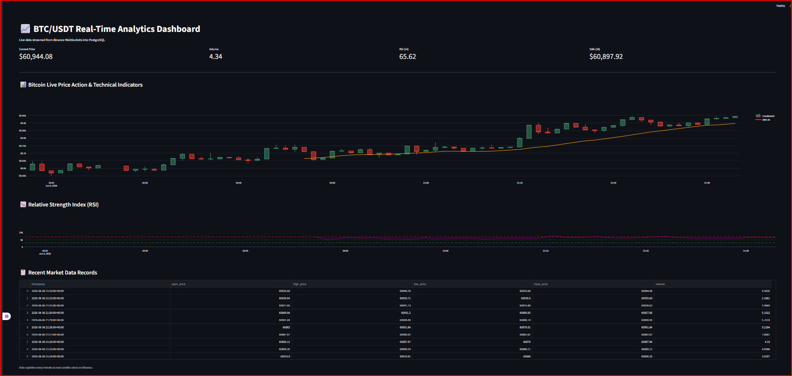

# Real-Time Crypto Analytics Pipeline & Dashboard

An End-to-End data engineering pipeline that streams real-time market data from the Binance WebSocket API, processes technical indicators on the fly, stores the data in a PostgreSQL database, and visualizes live updates on an interactive Streamlit dashboard.

## Architecture Architecture

- **Data Source:** Binance WebSocket API (BTC/USDT @kline_1m stream).
- **Ingestion & Processing:** Python script utilizing `websocket-client` and `pandas-ta` for real-time technical indicators calculations (SMA, RSI).
- **Storage:** PostgreSQL relational database optimized with chronological indexing.
- **Visualization:** Streamlit web application integrated with dynamic Plotly charts (Candlesticks & Line charts).

##  Tech Stack

- **Language:** Python 3.x
- **Database:** PostgreSQL
- **Libraries:** `psycopg2-binary`, `websocket-client`, `pandas`, `pandas-ta`, `streamlit`, `plotly`

## How to Run the Project

### 1. Prerequisites & Database Setup

Create a PostgreSQL database named `crypto_db` via pgAdmin or psql.

### 2. Install Dependencies

```bash
pip install websocket-client psycopg2-binary pandas pandas-ta streamlit plotly
```
## 📊 Analyse et Description du Dashboard (image_3131e9.png)

Voici une vue d'ensemble de l'interface de notre application Streamlit qui affiche en temps réel les données de marché pour la paire **BTC/USDT** sourcées via l'API WebSocket de Binance.



###  Les Métriques Flash en Temps Réel (Top KPIs)
* **Current Price ($60,944.08) :** Affiche le tout dernier prix du Bitcoin rafraîchi instantanément à chaque nouveau tick du WebSocket.
* **Return (4.34) :** Indique la variation ou le rendement calculé à la volée sur la fenêtre de temps analysée.
* **RSI (14) (65.62) :** L'indicateur de force relative (Relative Strength Index). À 65.62, le marché montre une forte pression acheteuse, approchant de la zone de surachat (70).
* **SMA (20) ($60,897.92) :** La Moyenne Mobile Simple calculée sur les 20 dernières périodes, servant de support dynamique pour analyser la tendance.

### Action des Prix (Candlestick & Technical Indicators)
Le graphique principal est un **Candlestick Chart (Graphique en chandeliers japonais)** interactif généré via Plotly. 
* Il montre l'évolution du prix (Open, High, Low, Close).
* Une ligne jaune superpose la **SMA (20)** directement sur les bougies, permettant de visualiser instantanément si le prix actuel est au-dessus ou au-dessous de sa moyenne à court terme pour capter la tendance.

### Oscillateur de Tendance (Relative Strength Index - RSI)
Juste en dessous, un graphique dédié trace l'évolution de l'indicateur **RSI**. Une ligne pointillée horizontale (généralement à 70 et 30) permet aux traders de repérer en un coup d'œil les moments de surachat ou de survente en temps réel.

### Historique Brut (Recent Market Data Records)
Tout en bas, une table de données dynamique (Dataframe) liste les derniers enregistrements stockés chronologiquement dans notre base de données **PostgreSQL**. Elle permet de valider l'intégrité de la pipeline de données (Data Pipeline) et de vérifier les valeurs exactes de chaque bougie d'une minute (`kline_1m`).
